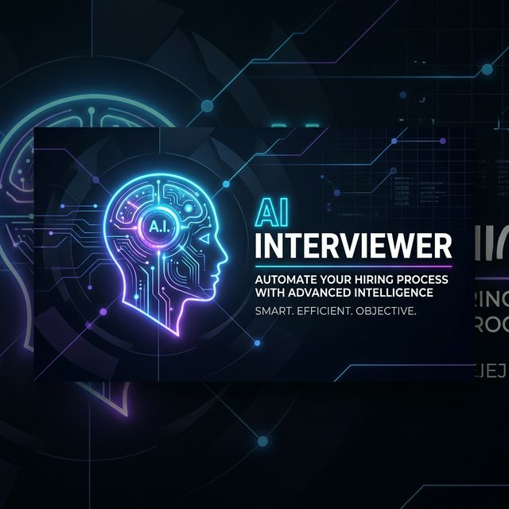
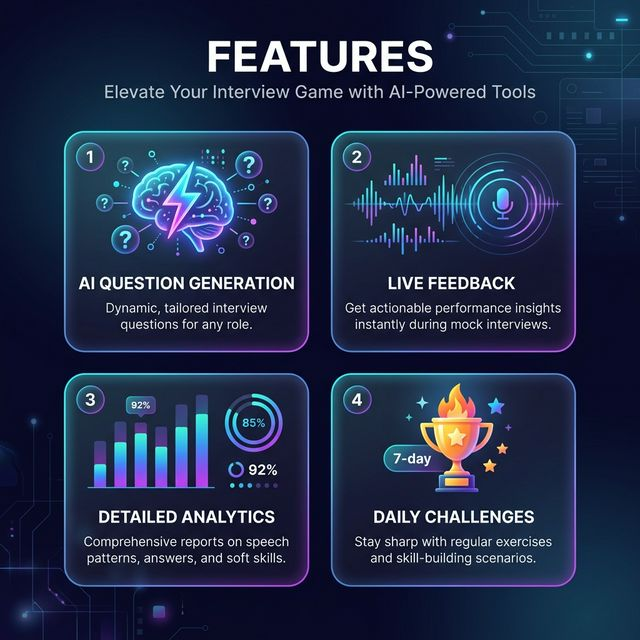

# 🤖 AI Interviewer

<div align="center">



### Elevate your career with local AI-powered mock interviews.
**Adaptive • Cognitive Analysis • Privacy First • Real-time Feedback**

[](https://nodejs.org/)
[](https://react.dev/)
[](https://www.mongodb.com/atlas)
[](https://ollama.com)
[](LICENSE)

[Features](#-key-features) • [How it Works](#-how-it-works) • [Tech Stack](#-the-tech-stack) • [Setup Guide](#-setup-guide) • [Architecture](#-project-architecture)

</div>

---

## ⚡ Key Features



-   **🧠 Adaptive AI Core:** Powered by **Ollama** (`llama3.2`), the system dynamically generates questions based on your background and real-time performance.
-   **💬 Real-Time Cognitive Feedback:** Not just "correct" or "incorrect." Get deep analytical feedback via **WebSockets** as you answer.
-   **📈 Detailed Analytics Dashboard:** Visualize your growth with category-wise scoring (Communication, Technical, Behavioral, and Confidence).
-   **🔥 Daily Practice Arena:** Maintain your streak! Tackle 5 unique daily challenges across diverse domains like Aptitude, General Knowledge, and Verbal Ability.
-   **🛡️ Privacy First:** Unlike commercial AI interviewers, your data and conversations stay local. Powered by your own GPU/CPU via Ollama.
-   **🎮 Gamified Experience:** Earn achievements, track streaks, and climb the leaderboard as you master your interview skills.

---

## 🏗️ How it Works

The AI Interviewer uses a **loop-based cognitive feedback system**:

1.  **Context Loading:** The server pulls your skills and targeted role from your profile.
2.  **AI Orchestration:** Ollama generates an initial question tailored to your level.
3.  **Real-Time Processing:** As you send your answer, the Backend evaluates it for clarity, technical accuracy, and structure.
4.  **Feedback Loop:** The AI adjusts difficulty—if you ace a question, the next one pushes your limits. If you struggle, it provides constructive hints.

---

## 🛠️ The Tech Stack

### High-Performance Backend
-   **Runtime:** Node.js 18+ (ES Modules)
-   **API Framework:** Express.js
-   **Real-time Engine:** Socket.IO for live AI interactions
-   **AI Foundation:** [Ollama](https://ollama.com) (Default: `llama3.2`)
-   **Database:** MongoDB Atlas (Mongoose ODM)
-   **Security:** JWT with Refresh Token rotation, Helmet, and Rate Limiting

### Modern Frontend
-   **Library:** React 18 + Vite (for lightning-fast builds)
-   **State Management:** Zustand (lightweight & scalable)
-   **Styling:** Tailwind CSS + custom micro-animations
-   **Interactivity:** Framer Motion & Lottie-React for high-end UI "feel"
-   **Visuals:** Chart.js for progress tracking, Swiper.js for carousels

---

## 🚀 Setup Guide

### 1. Requirements
Ensure you have **Node.js 18+**, **MongoDB**, and **Ollama** installed.

### 2. Prepare AI
Download and pull the model:
```bash
ollama pull llama3.2
```

### 3. Installation
```bash
git clone https://github.com/riyarawat1350/Ai-interviewer-.git
cd Ai-interviewer-
npm install
```

### 4. Configuration
Create a `.env` in the root:
```env
MONGODB_URI=your_mongodb_atlas_uri
JWT_SECRET=your_jwt_secret
OLLAMA_BASE_URL=http://localhost:11434
OLLAMA_MODEL=llama3.2
```

Also, set up the frontend: `client/.env`
```env
VITE_API_URL=http://localhost:5000/api
VITE_SOCKET_URL=http://localhost:5000
```

### 5. Launch
```bash
# Start both server and client together
npm run dev
```

---

## 📁 Project Architecture

```text
├── client/              # React + Vite (Frontend)
│   ├── src/
│   │   ├── components/  # Atomic UI components
│   │   ├── pages/       # Dashboard, Landing, Interview Arena
│   │   └── stores/      # Zustand Global State
├── server/              # Node.js + Express (Backend)
│   ├── src/
│   │   ├── services/    # AI, Analytics & Daily Logic
│   │   ├── websocket/   # Live Socket handlers
│   │   └── controllers/ # API Endpoint logic
└── docs/                # Project Documentation & Assets
```

---

## 🤝 Contributing
Contributions are what make the open-source community an amazing place to learn, inspire, and create.
1. Fork the Project
2. Create your Feature Branch (`git checkout -b feature/AmazingFeature`)
3. Commit your Changes (`git commit -m 'Add some AmazingFeature'`)
4. Push to the Branch (`git push origin feature/AmazingFeature`)
5. Open a Pull Request

---

## 📜 License
Distributed under the **MIT License**. See `LICENSE` for more information.

<div align="center">

Built with ❤️ for **GDG Hackathon 2026**

</div>